# Deploying Static Website in Amazon S3 using AWS Cloudformation

## Objective: 
- Configure AWS CLI 
- Create S3 bucket using Cloudformation
- Create an Index html file to host and deploy it to S3 
- Make it publicly accessible for public to view the content of your website
--- 
## Take Aways: 
- Configuring AWS CLI 
- Using CloudFormation in AWS to create resources
- Creating S3 bucket and few of the properties required to create a basic S3 bucket 
- S3 Bucket Policies 
--- 
## AWS CLI Commands: 
- `aws sts get-caller-identity` # this provides the current AWS Account details that has been configured like UserID, Account ID and ARN 

    Ex: 
    {
        "UserId": "CXXXXXXXXXXXXX",
        "Account": "XXXXXXXXXXX",
        "Arn": "arn:aws:iam::XXXXXX:user/XXXXXXXX"
    }

    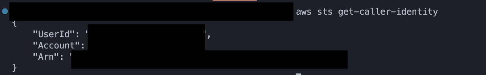
- aws configure # pass in the AWS Access Key, Secret Access Key as prompted in the CLI to configure the CLI to use your AWS account 
- List and confirm if the bucket is already existing using 
    - Using AWS CLI run the command `aws s3 ls | grep <your_s3_bucket_name>`. As you can see in the below screenshot, bucket doesn't exist in the AWS. 
        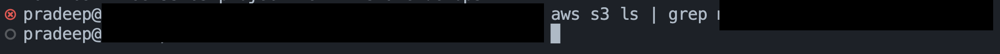
    - You can also check the buckets in AWS Console. Navigate to S3 in AWS Console and search with the `<your_s3_bucket_name>` mentioned in the cloudformation template file. 
        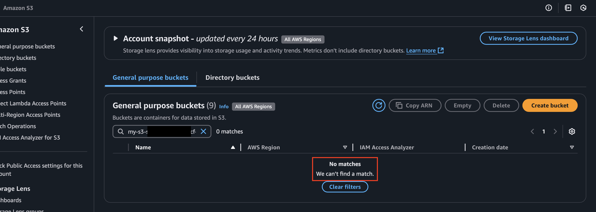
- Create S3 bucket from AWS CLI using command `aws cloudformation create-stack --stack-name s3-cf-web-stack --template-body file://<your_cf_yaml_file_name>` 
- Check the status of the Cloudformation Stack 
    - AWS CLI using command `aws cloudformation describe-stacks --stack-name <your_stack_name>`
      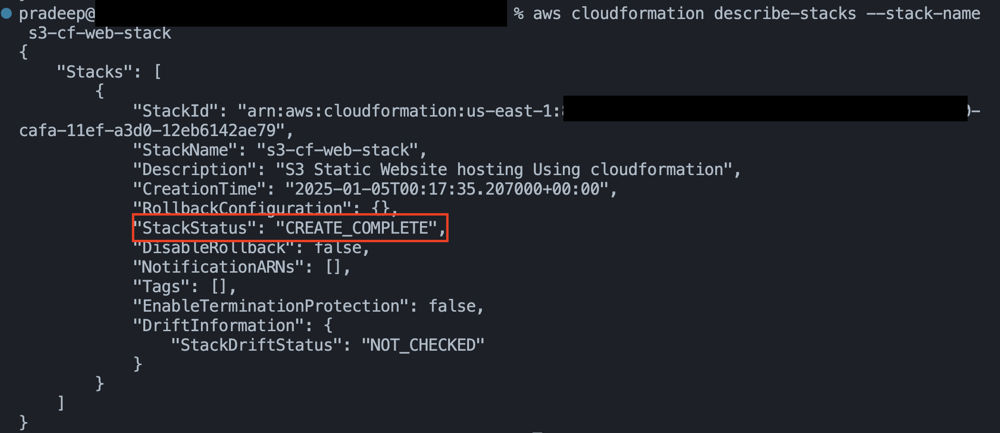
    - AWS Console 
      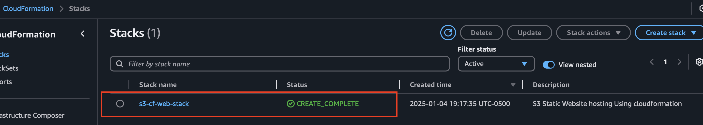
- Check if the S3 bucket is created in AWS 
    - Using AWS CLI with command `aws s3 ls | grep <your_s3_bucket_name>`
      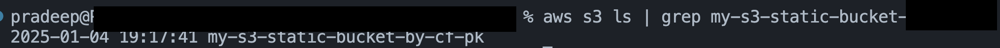 
    - AWS Console: 
      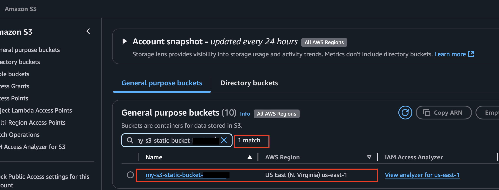
- Check if any objects exists in the S3 bucket created. At this point no objects would be present as we just created the S3 bucket
    - From AWS CLI with command `aws s3 ls <your_s3_bucket_name>`
    - From AWS CLI click on your bucket name to view the list of objects in it. 
- Create an wesbite hosting content file at project level. I have created an HTML file in this case with some basic content in it within at the project level. 
- Copy the wesbite hosting content file to AWS S3 bucket you created from AWS CLI using command `aws s3 cp index.html s3://my-s3-static-bucket-by-cf-pk` 
- Validate the S3 object is created within the S3 bucket created. You should see the index.html file in the bucket.
    - From AWS CLI using command `aws s3 ls <your_s3_bucket_name>` 
    - From AWS Console, refresh your S3 bucket objects page 

---
## Errors/ Challenges Faced: 
I did use wrong template format version '2019-09-09' which gave the below error message. Updated it to the right version as in the below screenshot in the resolution.

Error Message: An error occurred (ValidationError) when calling the CreateStack operation: Template format error: 2019-09-09 is not a supported value forAWSTemplateFormatVersion.
---
## Resolution: Update the AWSTemplateFormatVersion to correct version - 2010-09-09 
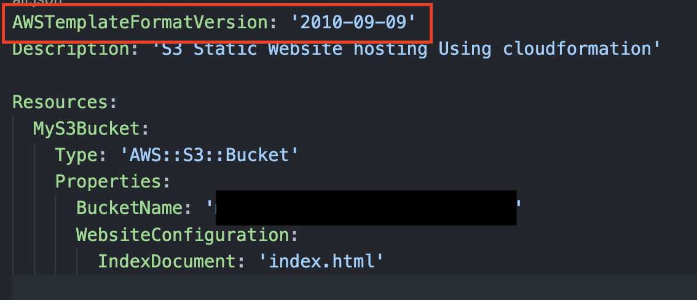 
---
## Validation: 
Go to AWS Console >> S3 Buckets >> Bucket >> Object(index.html) >> Object URI 
- Refer to the below screenshot to get the Object URI. 
  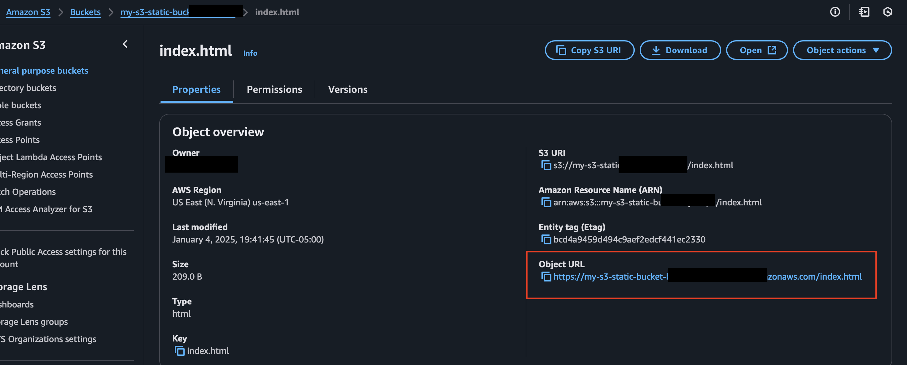 
- Object URI is the link that link where users can access to view the content. 

## Access Denied? 
Any guesses? If you have some idea on Amazon S3 buckets, you might have already figured out that we haven't provided any S3 bucket property to enable public access. By default AWS Buckets have public access is blocked. 

- Template code before the public access is enabled and bucket policy is attached. 
  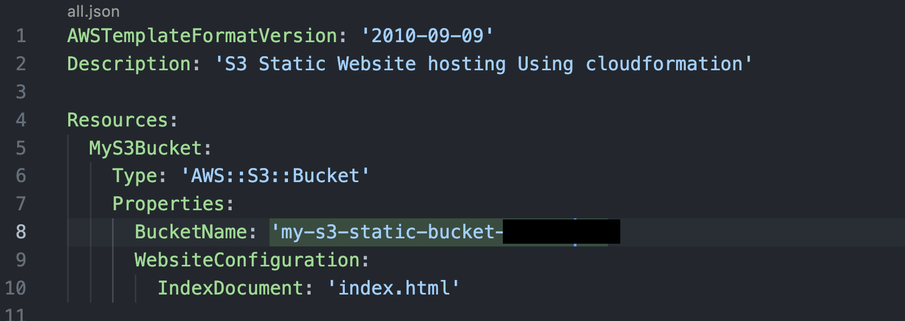
- Template code after the public access is enabled and bucket policy is attached. 
  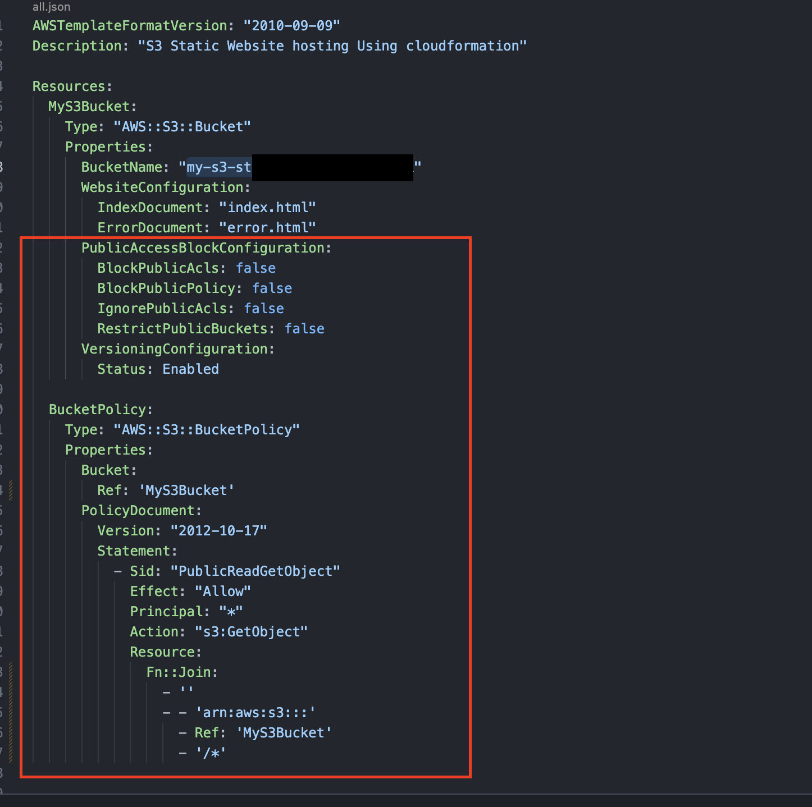

- update cloudformation stack command `aws cloudformation update-stack --stack-name s3-cf-web-stack --template-body file://<your_cf_yaml_file_name>`
---
## Deleting Stack:
- Deleting the cloudformation stack directly with S3 bucket created fails. 
- We need to delete the S3 bucket recursively and then delete the cloudformation stack 
---
## Deletion Commands: 
- aws s3 rm s3://<bucket-name> --recursive # to delete the S3 bucket from CLI recursivley all the objects
- aws s3 rb s3://<bucket-name>  # once the bucket is empty delete the bucket with this command
- aws cloudformation delete-stack --stack-name s3-cf-web-stack # to delete the cloudformation stack 
---
## Validation: 
Validate in the AWS Console to see the  S3 bucket is removed and Cloudformation Stack is removed. 
---
## Conclusion: 
S3 works best for hosting static websites to ensure high availability and scaling